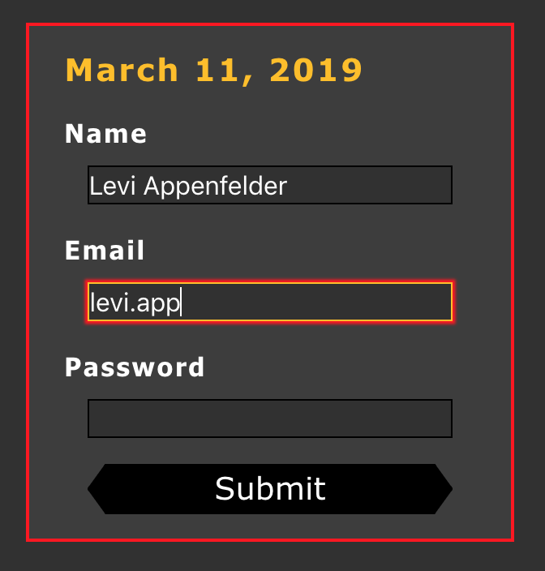
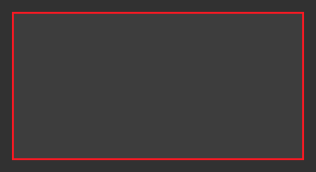
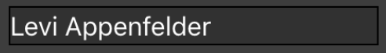
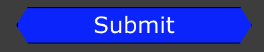

## Basic Style

___
___

___
___

### Main Page Container For Dark Mode

#### **div** ####

  * #### **align-self: center** ####

  * #### **box-sizing: border-box** ####

  * #### **max-width: 1366px** ####

  * #### **width: 100%** ####

  * #### **background-color: $darker-gray (#313131)** ####

___
___

___
___

### Main Form Container For Dark Mode

#### **div** ####

  * #### **align-items: center** ####

  * #### **box-sizing: border-box** ####

  * #### **background-color: $dark-gray (#3D3D3D)** ####

  * #### **width: 30%** ####

  * #### **margin: 5%** ####

  * #### **padding: 2.5%** ####

  * #### **border: 2px solid $primary-color (#0000ff)** ####

____
____

____
____

### Heading Style For Dark Mode 

#### **h1** ####

  * #### **font-family: Verdana, Tahoma, sans-serif** ####

  * #### **align-self: flex-start** ####

  * #### **font-size: $heading-size (1.5rem)** ####

  * #### **font-weight: bold** ####

  * #### **margin-bottom: 25px** #### 

  *  #### **color: $secondary-color (yellow)** ####

  * #### **letter-spacing: 0.1rem** ####

____
____

____
____

### Form Input Style For Dark Mode

#### **form** ####
    
   * #### **width: 100%** ####

#### **input** ####

   * #### **background-color: $darker-gray (#313131)** ####
    
   * #### **font-size: $heading-size (1.5rem)** ####

   * #### **color: $main-background (white)** ####

   * #### **width: 100%** ####

   * #### **margin-bottom: 10px** ####

   * #### **border: 0.5px solid $text-color (black)** ####

  ____
  ____

____
____

### Button Style For Dark Mode

#### **button** ####

* #### **width: 60%** ####

* #### **background-color: $text-color** ####

* #### **font-size: $heading-size (1.5rem)** ####

* #### **color: $main-background (white)** ####

* #### **margin-top: 10px;** ####

* #### **border: 0.5px solid $text-color (black)** ####
* #### **font-family: Verdana, Tahoma, sans-serif** ####

____
____

____
____

#### **hovered button** ####

* #### **width: 60%** ####

* #### **background-color: $primary-color** ####

* #### **font-size: $heading-size (1.5rem)** ####

* #### **color: $main-background (white)** ####

* #### **margin-top: 10px;** ####

* #### **border: 0.5px solid $text-color (black)** ####
* #### **font-family: Verdana, Tahoma, sans-serif** ####

____
____

____
____

### Text Style For Dark Mode

#### **p** ####

* #### **font-family: Verdana, Tahoma, sans-serif** ####

* #### **font-size: $heading-size (1.5rem)** ####

* #### **font-weight: bold** ####

* #### **margin-bottom: 0px** #### 

*  #### **color: $main-background (white)** ####

* #### **letter-spacing: 0.1rem** ####

* #### **margin-top: 10px** ####

____
____

